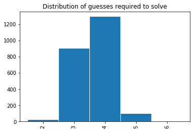

# Yet Another Wordle Bot

Seems like Wordle bots are the new sodoku solver. This is my attempt.

Inspired by [this video](https://www.3blue1brown.com/lessons/wordle), the bot uses an entropy-based model to find the best word to choose. Like other analyses, this bot has identified 'soare' as the best opening move. In its default interactive mode, the bot will make a suggestion and ask what word you played. It will then ask you the response pattern you get from the game. Enter the response pattern as a string of the characters 'X', 'S', and 'M' where 'X' means the letter is not in the word, 'S' means the letter is in the wrong spot in the word, and 'M' means the letter is in the correct position in the word.

The bot picks guesses from the list of all legal guesses (guesses.txt). To identify the guess that provides the most information, the bot looks at the smaller list of all possible Wordle solutions (answers.txt). Using a list full of words you don't know to guess and checking against the leaked list of possible solutions might feel like cheating. If so, replace each file with a different list of words.

